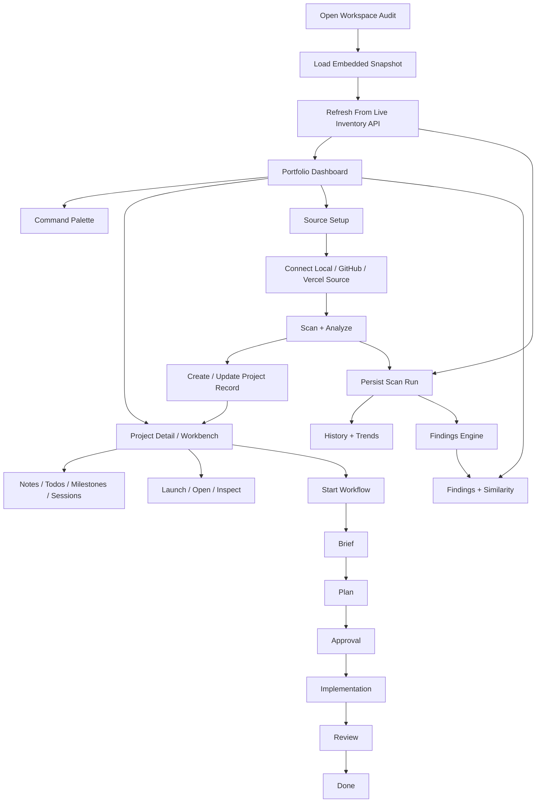

# Product Flowchart

```mermaid
flowchart TD
    A[Open Workspace Audit] --> B[Load Embedded Snapshot]
    B --> C[Refresh From Live Inventory API]
    C --> D[Portfolio Dashboard]

    D --> E[Command Palette]
    D --> F[Project Detail / Workbench]
    D --> G[Source Setup]
    D --> H[Findings + Similarity]

    G --> I[Connect Local / GitHub / Vercel Source]
    I --> J[Scan + Analyze]
    J --> K[Create / Update Project Record]
    K --> F

    F --> L[Notes / Todos / Milestones / Sessions]
    F --> M[Launch / Open / Inspect]
    F --> N[Start Workflow]

    N --> O[Brief]
    O --> P[Plan]
    P --> Q[Approval]
    Q --> R[Implementation]
    R --> S[Review]
    S --> T[Done]

    C --> U[Persist Scan Run]
    J --> U
    U --> V[History + Trends]
    U --> W[Findings Engine]
    W --> H
```
